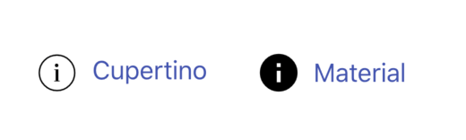

  

## One code, two mode, use cupertino's widgets on ios, use material's widget on android or fuchsia.

### [简体中文](./README.md)

  **`At present, only the Cupertino mode has been tested. Material components are relatively perfect. Material mode testing will be supplemented later.`**

## Foundation classes
* BaseStatelessWidget

  extend StatelessWidget，used to build stateless widget

  Subwidgets must be override `buildByCupertino、buildByMaterial`, they are used to build two modes

* BaseStatefulWidget

  extend StatefulWidget，used to build stateful widget

  Sub State class must be extend `BaseState` and override `buildByCupertino、buildByMaterial`, they are used to build two modes

* BaseClass

  general base class，used to build general class

  Subclasses `buildByCupertino、buildByMaterial`, they are used to build two modes

* basePlatform (parameter)

  currently platform，default is the `defaultTargetPlatform` 

  use `setPlatform(TargetPlatform targetPlatform)` to change the platform.

  Suggest use  `BaseApp(targetPlatform: TargetPlatform...)` to set the platform.

  default: `TargetPlatform.iOS` use `Cupertino mode` to build， `TargetPlatform.android` or `TargetPlatform.fuchsia` use `Material mode` to build.

## Features
* `useCupertino, useMaterial`

  These two methods can be used to determine the current mode of use，to build differentiation on under two modes。
  
* Every widget contains `Map<String, Object> cupertino, Map&lt;String, Object> material`, 2 parameters，to set up differentiation settings for 2 modes，2 modes has common parameters，will be given to the values in the current mode and then to the common values，example：

      BaseIcon(
        // will given the values from material parameters, then to the common values on Material mode.
        icon: Icons.info,
        'cupertino': <String, Object>{
          // will given this 'icon' then to the common 'icon' on Cupertino mode.
          'icon': Cupertinos.info,
        }
      );

    Result: will use Cupertinos.info on Cupertino mode, use Icons.info on Material mode.

  

* Can use `forceUseMaterial, forceUseCupertino` to force build by another mode. Use `disabled` to prohibit build（will use `Container()` to instead）

      'cupertino': {
        // force use Mcterial mode to build
        'forceUseMaterial': true,
        // prohibit build，will use `Container()` to instead
        'disabled': true,
      }
      'material': {
        // force use Cupertino mode to build
        'forceUseCupertino': true,
        // prohibit build，will use `Container()` to instead
        'disabled': true,
      }

* **`Special description，very important`**

    **`forceUseMaterial, forceUseCupertino`** the parameters have not been strictly tested, please use them carefully! Use carefully! Use carefully!

    Many material widgets need Material as there are ancestor widget，on Cupertino mode set forceUseMaterial: true，will default to add Material() as there are parent widget，and will remove the splash，and the BaseApp's cupertinoTheme parameter is not valid. Unpredictable bugs such as style confusion may occur, so use them carefully. These two parameters may be deleted later.

    **`If want to change the mode, suggest use BaseApp's targetPlatform to change the platform.`**

## Widgets List
|Widget|Material mode|Cupertino mode|
|:---------------|:--------|:----------|
|BaseApp|MaterialApp|CupertinoApp|
|BaseAppBar|AppBar|CupertinoNavigationBar|
|BaseBarItem|BottomNavigationBarItem|BottomNavigationBarItem|
|BaseButton|MaterualButton FlatButton, FlatButton.icon OutlineButton, OutlineButton.icon|CupertinoButton|
|BaseIconButton|IconButton|CupertinoButton|
|BaseAlertDialog|AlertDialog|CupertinoAlertDialog|
|BaseDialogAction|FlatButton|CupertinoDialogAction|
|BaseIcon|Icon|Icon|
|BaseIndicator|CircularProgressIndicator|CupertinoActivityIndicator|
|BaseRefresh|RefreshIndicator|CustomScrollView + CupertinoSliverRefreshControl|
|BaseScaffold|Scaffold|CupertinoPageScaffold|
|BaseScrollBar|ScrollBar|CupertinoScrollBar|
|BaseSection|custom Container|custom Container|
|BaseTile|ListTile|custom InkWell without splash|
|BaseSlider|Slider|CupertinoSlider|
|BaseSwitch|Switch|CupertinoSwitch|
|BaseTabBar|BottomNavigationBar|CupertinoTabBar|

## Result Images

### [简单示例](./example/)
